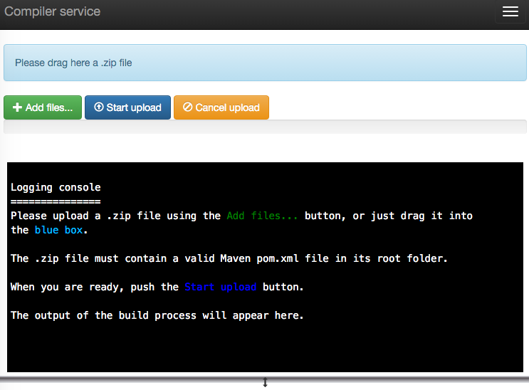
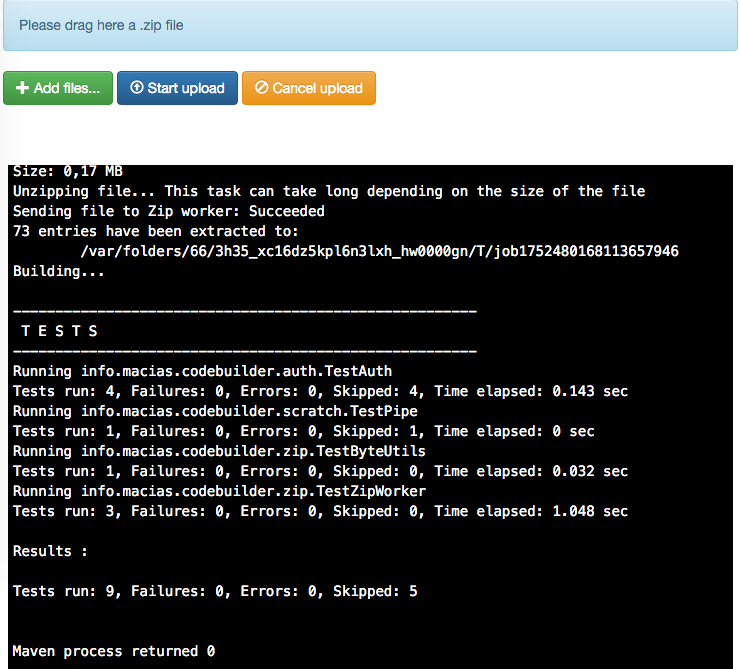

# Web code builder

Demo app about asynchronous architectures for long-response-time web applications.

It uses the next technologies:

* [Vertx.io](http://vertx.io) in the backend.
* [jQuery](http://www.jquery.com) and [Dropzonejs](http://www.dropzonejs.com/) in the frontend.
* [jEaSSE](https://github.com/mariomac/jeasse), my own backend implementation of Server-Sent Events for real time
  message subscription from the frontend to the backend.
  
The backend is coded in [Kotlin](https://kotlinlang.org/), my brand-new favourite programming language :bowtie:

## Quick demo

## How to compile and use

1. Build the project with maven:

		mvn package
		
2. Create a `config.properties` file that specifies your `M2_HOME` location, e.g.:

		m2.home=/home/user/.m2
		
3. Run the maven all-in-one jar package specifying the path to the configuration file:

		cd target/
		java -Dconfig=path/to/config.properties -jar codebuilder.jar
		
4. Go to `http://localhost:8080/gui`, using `user` as both username and password in the login screen. You will see
the main screen of the application:

 

5. Drag a .zip file to the blue box, which contains the Maven pom.xml in its root folder.

6. Click on the "start upload" button and the upload and building process. You will see the real-time output of the
process in the console:

 

7. The result files will be automatically downloaded. You can also download them by using the "Download link" anchors
   in the console.

## TO DO

As this is only a demo project, many improvements would be required for a production environment:

- Provide a persistent authentication system (now for testing, user/password is hardcoded in memory)
- Pack multiple-produced artifacts (JARs, WARs...) into a single zip file to avoid security warnings in some browsers.

Other tasks I will do in the near future:

- Document code
- Document design and architecture

